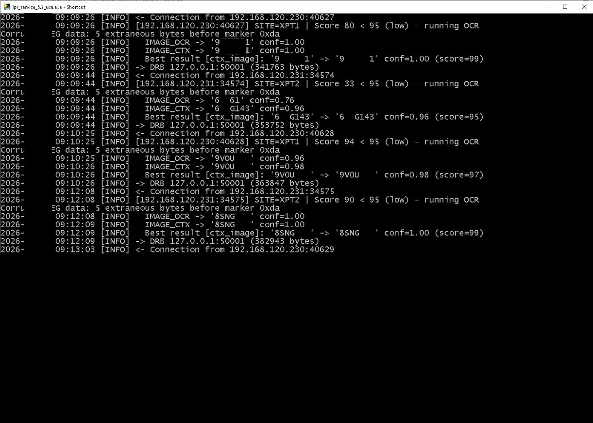

# Tattile Vega One LPR Integration

AI-enhanced middleware for improving license plate recognition accuracy in commercial tunnel car wash operations.

Система підвищення точності розпізнавання номерних знаків для комерційних тунельних автомийок на базі Tattile Vega One та AI.

---

🇺🇸 [English](#english)

🇺🇦 [Українська](#українська)

---

# English

## Project Overview

This project documents the development and deployment of an AI-enhanced middleware solution designed to improve license plate recognition accuracy for legacy Tattile Vega One systems operating in commercial tunnel car wash environments.

The solution was successfully implemented at two Checkered Flag Car Wash locations:

- Irvine, California
- Lake Forest, California

Each site operates two Tattile Vega One LPR cameras for automatic membership identification and vehicle tracking.

The system significantly reduced manual interventions and improved recognition performance for difficult California license plates.

---

## Business Requirements

The primary objective was to improve customer experience and reduce operational delays caused by incorrect license plate recognition.

The original Tattile system experienced difficulties with:

- Black California license plates
- Yellow or white non-reflective characters
- Confusion between the letter "O" and the digit "0"
- Low-confidence OCR results

These issues frequently required employees to manually enter customer information.

---

## Deployment Environment

| Parameter | Value |
|---|---|
| Locations | Irvine, CA / Lake Forest, CA |
| Business | Checkered Flag Car Wash |
| LPR Cameras | Tattile Vega One |
| Management Platform | DRB SiteWatch Manager |
| Communication Protocol | XML over TCP |
| Processing Server | Existing DRB Server |
| Programming Language | Python 3 |

The middleware was deployed directly on the DRB server due to network administration restrictions that prevented the installation of an external processing node.

---

## System Architecture

<p align="center">
  
</p>

<p align="center">
<i>Figure 1. AI-enhanced middleware architecture for Tattile Vega One and DRB SiteWatch integration.</i>
</p>

---

## Hardware and Software Stack

<p align="center">
  
</p>

<p align="center">
<i>Figure 2. Network topology.</i>
</p>


### Hardware

- Tattile Vega One LPR Cameras
- DRB SiteWatch Infrastructure
- Existing Production Server Environment

### Software

- Python 3
- FastALPR
- Wireshark
- ONNX Runtime

### AI Models

#### Detection Model

```text
yolo-v9-s-608-license-plates-end2end.onnx
```

License plate localization and detection.

#### OCR Model

```text
cct_s_v2_global.onnx
```

Character recognition and confidence estimation.

---

## Reverse Engineering Process

Official protocol documentation for the Tattile data stream was unavailable.

The integration process required:

- Network traffic analysis using Wireshark
- XML packet inspection
- Identification of IMAGE_OCR and IMAGE_CTX formats
- TCP communication analysis
- Packet timing optimization
- Testing of retransmission mechanisms

The reverse engineering process enabled complete understanding of the communication pipeline between Tattile cameras and DRB SiteWatch.

---

## Custom Middleware Development

A custom Python proxy service was developed to operate as an intelligent middleware layer.

The system performs the following operations:

### Step 1

Receive XML packets and image data from Tattile Vega One cameras.

### Step 2

Evaluate recognition confidence levels.

### Step 3

If confidence is acceptable:

- Forward original data directly to DRB SiteWatch.

### Step 4

If confidence is low:

- Execute FastALPR processing.
- Detect license plates using YOLOv9.
- Perform OCR using the CCT model.
- Apply character correction logic.
- Generate a new XML packet.
- Forward corrected data to DRB.

---

## Additional Features

The middleware includes several reliability improvements:

### Data Logging

- CSV export
- Image logging
- Event tracking

### Network Reliability

- TCP Keep-Alive
- Packet retry mechanisms
- Communication timeout optimization

### Character Correction Logic

Automatic corrections include:

```text
O → 0
I → 1
Q → 0
```

and other commonly misidentified symbols.

---

## Results

<p align="center">
  
</p>

<p align="center">
<i>Figure 2. Network topology.</i>
</p>

The implementation produced significant operational improvements.

### Recognition Performance

For problematic black California license plates:

```text
Recognition improvement: ~95%
```

### Overall Vehicle Traffic

Approximately:

```text
30% of all vehicles
```

benefited from improved recognition performance.

The percentage continues to increase as black California plates become more common.

### Business Impact

The solution achieved:

- Reduced manual customer assistance
- Faster tunnel throughput
- Improved membership identification
- Better customer experience
- Seamless compatibility with existing DRB infrastructure

---

## Lessons Learned

- Legacy systems can often be significantly improved without hardware replacement.
- AI-based OCR provides substantial benefits for difficult license plate types.
- Reverse engineering and network analysis are valuable skills for industrial integrations.
- Middleware architectures provide flexibility while maintaining compatibility with existing systems.
- Reliable logging and retry mechanisms are critical for production environments.

---

# Українська

## Огляд проекту

У цьому проекті описано розробку та впровадження AI-системи для підвищення точності розпізнавання номерних знаків на базі камер Tattile Vega One у комерційних тунельних автомийках.

Рішення було впроваджено на двох локаціях Checkered Flag Car Wash:

- Irvine, California
- Lake Forest, California

На кожній локації встановлено по дві камери Tattile Vega One для автоматичного визначення клієнтів програми membership.

---

## Бізнес-завдання

Основною метою було:

- зменшення ручного введення номерів співробітниками;
- покращення обслуговування клієнтів;
- збільшення пропускної здатності автомийки.

Основні проблеми стандартної системи:

- чорні каліфорнійські номерні знаки;
- символи без світловідбивного покриття;
- плутанина між літерами та цифрами (O та 0);
- низький рівень впевненості OCR.

---

## Середовище експлуатації

| Параметр | Значення |
|---|---|
| Локації | Irvine, CA / Lake Forest, CA |
| Бізнес | Checkered Flag Car Wash |
| Камери | Tattile Vega One |
| Система керування | DRB SiteWatch Manager |
| Протокол | XML через TCP |
| Сервер | DRB Production Server |
| Мова програмування | Python 3 |

Через обмеження доступу до мережевих налаштувань система була розгорнута безпосередньо на DRB сервері.

---

## Архітектура системи

(див. Figure 1 вище)

---

## Використані технології

### Обладнання

- Tattile Vega One
- DRB SiteWatch Infrastructure

### Програмне забезпечення

- Python 3
- FastALPR
- Wireshark
- ONNX Runtime

### AI-моделі

#### Детектор номерів

```text
yolo-v9-s-608-license-plates-end2end.onnx
```

#### OCR-модель

```text
cct_s_v2_global.onnx
```

---

## Реверс-інжиніринг протоколу

Офіційна документація щодо формату передачі даних була відсутня.

Було виконано:

- аналіз мережевого трафіку через Wireshark;
- дослідження XML-пакетів;
- аналіз форматів IMAGE_OCR та IMAGE_CTX;
- оптимізація таймінгів TCP-з'єднань;
- налаштування механізмів повторної передачі.

---

## Розробка middleware

Було створено власний Python-проксі, який працює як проміжний рівень між Tattile та DRB.

Алгоритм роботи:

1. Отримання XML та зображень.
2. Перевірка коефіцієнта впевненості.
3. Якщо результат якісний — пакет передається без змін.
4. Якщо результат сумнівний:

- запускається FastALPR;
- YOLO визначає номерний знак;
- CCT виконує OCR;
- застосовується логіка виправлення символів;
- формується новий XML;
- дані передаються до DRB.

---

## Додаткові можливості

### Логування

- CSV-експорт
- Збереження зображень
- Журналювання подій

### Надійність

- TCP Keep-Alive
- Автоматичні повторні спроби
- Оптимізація таймаутів

### Автоматичні виправлення

```text
O → 0
I → 1
Q → 0
```

---

## Результати

Для чорних каліфорнійських номерних знаків:

```text
Покращення точності: близько 95%
```

Загалом система покращила розпізнавання приблизно для:

```text
30% автомобілів
```

що проходять через автомийку.

---

## Висновки

- Старі системи можна суттєво покращити без заміни обладнання.
- AI значно підвищує якість OCR для складних номерних знаків.
- Реверс-інжиніринг та аналіз мережевих протоколів є важливими навичками для промислових інтеграцій.
- Middleware забезпечує гнучкість та сумісність із існуючими системами.
- Надійне логування та механізми повторної передачі критично важливі для production-середовища.
